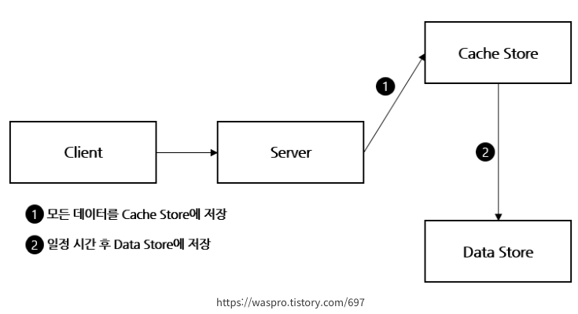

# 캐싱을 통한 성능 개선 전략

---

## 목차

* [캐싱의 개념과 기대 효과](#캐싱의-개념과-기대-효과)
  + [캐싱이란?](#캐싱이란)
  + [기대효과](#기대-효과)
* [로컬 캐시 vs 글로벌 캐시](#로컬-캐시-vs-글로벌-캐시)
  + [로컬 캐시](#로컬-캐시)
  + [글로벌 캐시](#글로벌-캐시)
* [캐싱 전략 패턴](#캐싱-전략-패턴)
  + [캐시 읽기 전략 (Read Cache Strategy)](#캐시-읽기-전략--read-cache-strategy-)
    - [Look Aside 패턴](#look-aside--cache-aside--패턴)
    - [Read Through 패턴](#read-through-패턴)
  + [캐시 쓰기 전략 (Write Cache Strategy)](#캐시-쓰기-전략--write-cache-strategy-)
    - [Write Back 패턴](#write-back--write-behind--패턴)
    - [Write Through 패턴](#write-through-패턴)
    - [Write Around 패턴](#write-around-패턴)
  + [캐시 문제점 및 해결 방안](#캐시-문제점-및-해결-방안)
    - [캐시 쇄도(cache stampede)](#캐시-쇄도--cache-stampede--현상)
    - [캐시 관통(cache penetration)](#캐시-관통--cache-penetration-)
  + [비즈니스 로직 중 캐시를 적용해 볼만한 포인트](#비즈니스-로직-중-캐시를-적용해-볼만한-포인트)
    - [콘서트 세션(일정) 조회](#1-콘서트-세션--일정--조회)
    - [콘서트 좌석 조회](#2-콘서트-좌석-조회)

---

## 캐싱의 개념과 기대 효과

### 캐싱이란?
데이터를 임시 저장소에 저장하여, 동일한 데이터를 다시 요청할 때 더 빠르게 제공하는 기술.  
주로 자주 요청되거나 계산 비용이 높은 데이터를 저장해 빠른 응답 속도를 제공한다. 보통 메모리(RAM)를 사용해 빠른 응답 속도를 제공한다.  
캐싱에 적합한 데이터는 다음과 같다.
- 자주 조회되는 데이터
- 데이터의 변경주기가 빈번하지 않고, 단위 처리 시간이 오래걸리는 경우
- 데이터의 최신화가 반드시 실시간으로 이뤄지지 않아도 서비스 품질에 영향을 거의 주지 않는 데이터

### 기대 효과
- **응답 시간 단축:** 캐시에 저장된 데이터를 빠르게 제공해 사용자 경험을 향상시킨다.
- **부하 감소:** 자주 조회되는 데이터를 캐시에 저장하여 캐시 히트를 통해 DB 접근을 줄여 부하를 감소시킨다.
- **데이터 일관성:** 캐시에 저장된 데이터와 DB의 데이터가 일치하지 않을 수 있으므로 데이터 일관성을 유지하는 것이 중요하다.
- **성능 향상:** 캐시를 사용하면 DB 조회를 줄여 성능을 향상시킬 수 있다.

---

## 로컬 캐시 vs 글로벌 캐시

### 로컬 캐시
- **설명**
  - 서버마다 각 캐시 서버를 두고 따로 저장하는 전략이다. 로컬 서버의 리소스(Memory, Disk)를 사용한다.
  - 애플리케이션 내부에서 캐시를 사용.
  - Ehcache, Caffeine, Guava 등의 로컬 캐시 라이브러리를 사용한다.
- **장점**
  - 응답 속도가 빠르고 네트워크 비용이 적음.
  - 서버 애플리케이션과 라이프 사이클이 같아서 서버 재시작 시 캐시 초기화가 용이하다.
- **단점**
  - 캐시 크기가 제한되고, 분산된 환경에서 데이터 일관성 문제가 발생할 수 있음.
  - 애플리케이션이 다운되면 함께 사라짐.
  - 애플리케이션 메모리가 부족해질 수 있다.


### 글로벌 캐시
- **설명**
  - 여러 서버에서 한 캐시 서버에 접근하여 참조할 때 사용
  - Redis, Memcached 등의 외부 캐시 서버를 사용한다.
- **장점**
  - 확장성과 데이터 일관성이 좋음.
  - 별도의 캐시 서버를 두고 사용하기 때문에 서버 간 데이터 공유가 용이하다.
- **단점**
  - 네트워크 비용이 발생.
  - 네트워크 트래픽을 사용하기 때문에 로컬 캐시보다는 속도가 느리다.
  - 네트워크 단절 이슈가 발생할 수 있다.

---

## 캐싱 전략 패턴
- 일반적으로 캐시(cache)는 메모리(RAM)를 사용하기 때문에 데이터베이스 보다 훨씬 빠르게 데이터를 응답할 수 있어 이용자에게 빠르게 서비스를 제공할 수 있다.
- 하지만 기본적으로 RAM 의 용량은 커봐야 16~32G 정도라, 데이터를 모두 캐시에 저장해버리면 용량 부족 현상이 일어나 시스템이 다운될 수 있다.
- 따라서 어느 종류의 데이터를 캐시에 저장할지, 얼만큼 데이터를 캐시에 저장할지, 얼마동안 오래된 데이터를 캐시에서 제거하는지에 대한 `지침 전략` 을 숙지할 필요가 있다.

### 캐시 읽기 전략 (Read Cache Strategy)

#### Look Aside(Cache Aside) 패턴

- **설명**
  - 캐시에 저장된 데이터가 있는지 우선적으로 확인하고, 없으면 DB에서 조회.
- **장점**
  - 반복적인 읽기가 많은 호출에 적합. 캐시 장애 시에도 DB에서 데이터 조회 가능.
  - 캐시와 DB가 분리되어 가용되기 때문에 캐시 장애 대비 구성이 되어 있음.
- **단점**
  - 초기 조회 시 DB 호출 발생.
  - 캐시에 붙어 있던 connection 이 많았다면, 캐시가 다운된 경우 순간적으로 DB에 부하가 발생.
- **주의**
  - 캐시 쇄도(Cache Stampede) 현상 발생 가능. TTL 에 도달한 캐시가 삭제되면 여러 애플리케이션이 한꺼번에 DB를 조회해 문제 발생. 적절한 TTL과 미리 캐시에 데이터를 넣어두는 방법(Cache Warming)으로 해결
    가능.


#### Read Through 패턴

- **설명**
  - 캐시에서만 데이터를 읽어옴. 데이터 동기화를 라이브러리 또는 캐시 제공자에게 위임.
  - Cache Aside 방식과 비슷하지만, Cache Store에 저장하는 주체가 Server 이냐 Data Store 자체이냐에서 차이점이 있다.
- **장점**
  - 캐시와 DB 간의 데이터 동기화가 항상 이루어지기 때문에 데이터 정합성 유지.
- **단점**
  - 데이터 조회를 전적으로 캐시에만 의지하므로, 캐시 장애 시 서비스 이용에 문제가 발생.
- **주의**
  - 캐시 장애 시 서비스 전체 중단으로 빠질 수 있기 때문에 캐시 구성 요소를 Replication 또는 Cluster로 구성하여 가용성을 높여야 한다.

### 캐시 쓰기 전략 (Write Cache Strategy)
#### Write Back(Write Behind) 패턴

- **설명**
  - 데이터 저장 시 캐시에 먼저 저장하고, 일정 주기마다 DB로 반영.
  - 데이터를 저장할 때 DB에 바로 저장하지 않고, 캐시에 모아서 일정 주기 배치 작업을 통해 DB에 저장.
  - Write 가 빈번하면서 Read 시 많은 리소스를 소모하는 서비스에 적합.
- **장점**
  - DB 부하 감소.
  - 쓰기 쿼리 회수 비용과 시간을 줄일 수 있음.
- **단점**
  - 캐시 장애 시 데이터 유실 가능성이 있다.

#### Write Through 패턴

- **설명**
  - 데이터 저장 시 캐시와 DB에 동시에 저장하는 방식이다.
  - 먼저 캐시에 저장하고, DB에 저장한다.
- **장점**
  - 캐시의 데이터는 항상 최신 상태로 유지하기 때문에 데이터 일관성 유지.
  - 캐시 장애 시에도 DB에 데이터가 있어 서비스 이용 가능.
  - 데이터 유실이 발생하면 안되는 상황에 적합하다.
- **단점**
  - 쓰기 성능 저하 가능성. 요청마다 두번의 쓰기가 발생하므로 빈번한 수정이 발생하는 곳에선 부적합하다.


#### Write Around 패턴

- **설명**
  - 데이터 저장 시 DB 에만 저장하고, 캐시 갱신 없음.
  - Cache Miss 발생 시 DB 에서 데이터를 읽어와 캐시에 저장한다.
- **장점**
  - 쓰기 성능이 높음.
- **단점**
  - 데이터 불일치 가능성, 읽기 시 캐시 miss 발생.
  - 데이터베이스에 저장된 데이터가 수정, 삭제될 때마다 캐시의 데이터도 삭제/변경해야 하며, Cache 의 expiration 시간을 적절히 설정해야 한다.

---

## 캐시 문제점 및 해결 방안

### 캐시 쇄도(Cache Stampede) 현상
- 캐시 미스가 동시에 많이 발생하여 데이터베이스 조회가 늘어 데이터 베이스에 부담이 가중되는 현상
- 캐시가 한 번에 만료되어 여러 애플리케이션이 동시에 데이터베이스에 조회할 때 발생

### 해결방안
- 적절한 캐시 만료 시간을 설정(길지 않게 설정)
- Cache Warming
  - 캐시를 미리 생성시켜 주는 작업
  - 이벤트등 부하가 몰리기전 미리 정보를 캐시해두는 작업
- PER 알고리즘
  - 확률적 조기 재계산(Probabilistic Early Recompilation) 알고리즘
  - 캐시 값이 만료되기 전에 언제 데이터베이스에 접근해서 값을 읽어오면 되는지 최적으로 계산
  - 캐시된 데이터의 ttl 이 적을 수록, 캐시된 값을 다시 계산하는 시간이 클수록 더 높은 확률로 캐시된 값을 다시 계산
  > - currentTime: 현재 시간
  > - timeToCompute(Recompute time interval, delta): 캐시된 값을 다시 계산하는 데 걸리는 시간
  > - beta: 무작위성 조절 변수 (기본값은 1, 0보다 큰 값으로 설정 가능)
  > - random(): 0과 1 사이의 랜덤 값을 반환하는 함수
  > - expiry((that is, time() + pttl): 키를 재설정할 때 새로 넣어줄 만료 시간
  > - 계산식: `currentTime - (timeToCompute * beta * log(rand())) >= expiry` 조건이 참이면 DB조회 해서 새로 캐싱

<br><br>

### 캐시 관통 (Cache Penetration)
- 데이터베이스로부터 '값이 없다' 라는 상태를 캐싱하지 않으면 일어나는 현상
- 캐시에 없는 값을 요청할 때마다 데이터베이스에 요청하게 되어 데이터베이스에 부하가 발생

### 해결방안
- Null Object Pattern
  - 캐시에 없는 값을 요청할 때, 해당 키에 대한 값을 캐시에 저장하되, 값이 없다는 것을 저장해두는 방법
  - 객체 타입의 경우는 부재를 뜻하는 객체를 선언하여 사용하고, 원시타입의 경우는 이 객체를 대체할 특정값을 지정(약속)하여 값이 없는 상태를 캐싱한다. (Ex. 양수만 존재하는 데이터가 Null 이면 음수를 넣어놓음)

---

## 비즈니스 로직 중 캐시를 적용해 볼만한 포인트

### 1. 콘서트 세션(일정) 조회

---

```java
@UseCase
@RequiredArgsConstructor
public class GetAvailableConcertSessionsUseCase {

    private final ConcertService concertService;

    public List<ConcertSession> getAvailableConcertSessions(final Long concertId) {
        return concertService.getAvailableConcertSessions(concertId);
    }
}
```
#### 선정 이유
- 콘서트 세션 정보는 빈번하게 수정되지 않으므로 캐시를 적용하는 데 적합하다.
- 조회가 빈번하게 발생할것으로 예상되며 캐시를 적용하면 성능 향상을 기대할 수 있다.


#### 구현 방법

- `Look Aside + Write Around` 패턴을 사용
- 빈번하게 수정되는 데이터가 아니지만 조회는 빈번하게 발생하고 Redis 의 장애가 발생해도 서비스가 중단되지 않아야 하므로 `Look Aside` 패턴을 사용
- 캐시에 데이터가 없을 때 DB 조회 후 캐시에 저장하고, 캐시 만료 시간을 설정해 일정 시간이 지나면 캐시를 삭제하도록 구현
- 글로벌 캐시 서버인 Redis 를 사용하여 여러 서버에서 공유할 수 있도록 구성(다중 인스턴스인 경우 로컬 캐시를 사용하는 것보다는 일관성있는 데이터를 제공할 수 있다.)


#### 성능 비교
- k6로 부하 테스트를 진행하여 캐시 적용 전과 후의 성능 비교
- 시나리오
  - 초당 500개의 요청을 30초간 진행(대기열이 있기 때문에 초당 500개 정도의 요청이 발생할 것으로 예상)
  - 총 15,000개의 요청이 발생한다.

<br>

#### 성능 비교 결과
| **지표**                       | **캐시 적용 전**                                | **캐시 적용 후**                               | **변화율**                              |
|---------------------------------|-----------------------------------------------|-----------------------------------------------|---------------------------------------|
| **검사 통과율 (checks)**        | 97.40% (14610/15000)                         | 98.97% (14846/15000)                         | +1.57%                                |
| **받은 데이터 (data_received)** | 2.4 MB (79 kB/s)                             | 2.5 MB (82 kB/s)                             | +0.1 MB (3 kB/s)                      |
| **보낸 데이터 (data_sent)**     | 2.4 MB (78 kB/s)                             | 2.4 MB (78 kB/s)                             | 변화 없음                              |
| **HTTP 요청 차단 시간 (http_req_blocked)** | avg=505.72µs, min=0s, med=2µs, max=101.81ms, p(90)=6µs, p(95)=177.04µs | avg=138.81µs, min=0s, med=2µs, max=7.33ms, p(90)=5µs, p(95)=17µs | 차단 시간 대폭 감소                    |
| **HTTP 요청 연결 시간 (http_req_connecting)** | avg=489.66µs, min=0s, med=0s, max=101.78ms, p(90)=0s, p(95)=142µs | avg=127.45µs, min=0s, med=0s, max=7.31ms, p(90)=0s, p(95)=0s | 연결 시간 감소                        |
| **HTTP 요청 처리 시간 (http_req_duration)** | avg=17.5ms, min=875µs, med=3.63ms, max=317.48ms, p(90)=25.04ms, p(95)=135.95ms | avg=8.78ms, min=0s, med=3.09ms, max=152.41ms, p(90)=17.73ms, p(95)=32.58ms | 처리 시간 절반 감소                    |
| **대기 시간 (http_req_waiting)** | avg=17.47ms, min=864µs, med=3.61ms, max=317.47ms, p(90)=25.01ms, p(95)=135.91ms | avg=8.73ms, min=0s, med=3.06ms, max=152.23ms, p(90)=17.71ms, p(95)=32.53ms | 대기 시간 절반 감소                    |
| **반복 실행 시간 (iteration_duration)** | avg=1.01s, min=1s, med=1s, max=1.31s, p(90)=1.03s, p(95)=1.14s | avg=1s, min=1s, med=1s, max=1.15s, p(90)=1.01s, p(95)=1.03s | 변화 없음                              |
| **가상 사용자 수 (vus)**        | 500                                         | 500                                         | 변화 없음                              |

#### 캐시 적용 전/후 그래프
- 캐시 적용 전
  

<br>

- 캐시 적용 후
  

---

### 주요 비교
1. 검사 통과율
> - 캐시 적용 전: 97.40% (14610/15000)
> - 캐시 적용 후: 98.97% (14846/15000)
> - 캐시 적용 후 체크 통과율이 1.57% 향상됨

2. HTTP 요청 차단 시간
> - 캐시 적용 전: avg=505.72µs, max=101.81ms
> - 캐시 적용 후: avg=138.81µs, max=7.33ms
> - 캐시 적용 후 차단 시간이 대체로 짧아졌으며, 최대값도 크게 개선됨

3. HTTP 요청 연결 시간
> - 캐시 적용 후: avg=127.45µs, max=7.31ms
> - 캐시 적용 전: avg=489.66µs, max=101.78ms
> - 캐시 적용 후, 연결 시간이 현저히 단축됨

4. HTTP 요청 처리 시간
> - 캐시 적용 후: avg=8.78ms, max=152.41ms
> - 캐시 적용 전: avg=17.5ms, max=317.48ms
> - 캐시 적용 후, 처리 시간이 약 50% 단축되었으며, 최대 처리 시간 차이가 크게 개선됨

---

### 결론
- 캐시 적용 후 시스템의 성능이 전반적으로 향상되었다. 특히 요청 처리 시간이 약 50% 단축되었으며, 최대 처리 시간 차이가 크게 개선되었다.
- 서버의 부하를 더 잘 처리할 수 있는 능력을 보여주며, 전체적인 사용자 경험을 향상시킬 수 있다.


### 2. 콘서트 좌석 조회

---

```java
@UseCase
@RequiredArgsConstructor
public class GetConcertSeatsUseCase {

  private final ConcertService concertService;

  public ConcertSeatsInfo getConcertSeats(final Long sessionId) {
    return concertService.getConcertSeatsInfo(sessionId);
  }
}
```

- **미선정 이유**
  - 좌석의 경우 상태값이 빈번하게 변동되므로 캐시를 적용하기 부적합하다.
  - 좌석의 상태값이 빈번하게 변동되므로 캐시를 적용하면 데이터 불일치 문제가 발생할 수 있다.
  - 콘서트 시스템의 경우 앞에 대기열로 부하를 줄일 수 있기 때문에 캐시를 사용하지 않더라도 큰 부하가 걸리지 않을 것으로 예상된다.
  - 추후 일정 주기로 캐시를 갱신하는 방법으로 캐시 적용을 고려할 수 있다.

---

- 참고
  - [https://redis.io/docs/latest/develop/use/patterns/distributed-locks](https://redis.io/docs/latest/develop/use/patterns/distributed-locks)
  - [https://inpa.tistory.com/entry/REDIS](https://inpa.tistory.com/entry/REDIS-%F0%9F%93%9A-%EC%BA%90%EC%8B%9CCache-%EC%84%A4%EA%B3%84-%EC%A0%84%EB%9E%B5-%EC%A7%80%EC%B9%A8-%EC%B4%9D%EC%A0%95%EB%A6%AC#look_aside_%ED%8C%A8%ED%84%B4)
  - [https://techblog.uplus.co.kr/로컬-캐시-선택하기](https://techblog.uplus.co.kr/%EB%A1%9C%EC%BB%AC-%EC%BA%90%EC%8B%9C-%EC%84%A0%ED%83%9D%ED%95%98%EA%B8%B0-e394202d5c87#b188)
  - [https://kk-programming.tistory.com/83](https://kk-programming.tistory.com/83)
  - [https://velog.io/@brgndy/캐싱이란-y6vzuhvv](https://velog.io/@brgndy/%EC%BA%90%EC%8B%B1%EC%9D%B4%EB%9E%80-y6vzuhvv)