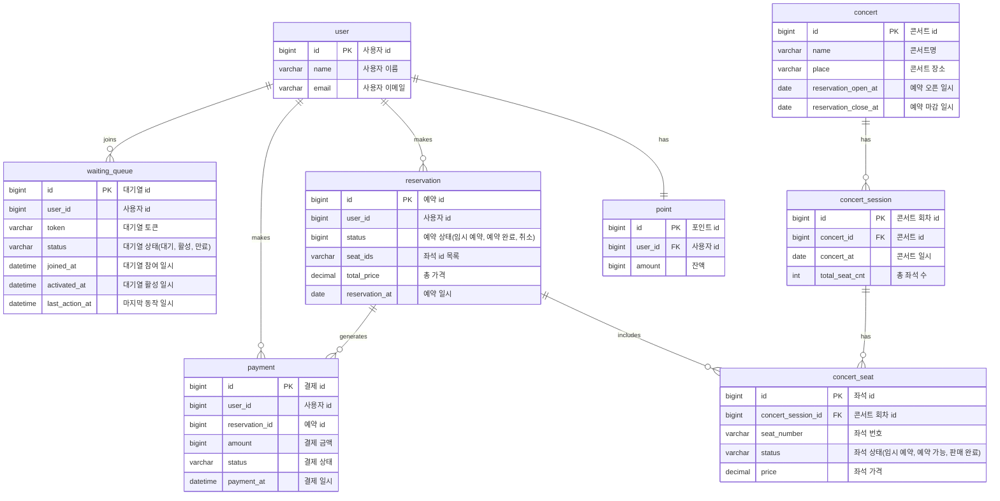

```mermaid
erDiagram
    user {
        bigint id PK "사용자 id"
        varchar name "사용자 이름"
        varchar email "사용자 이메일"
    }

    point {
        bigint id PK "포인트 id"
        bigint user_id FK "사용자 id"
        bigint amount "잔액"
    }

    waiting_queue {
        bigint id PK "대기열 id"
        bigint user_id "사용자 id"
        varchar token "대기열 토큰"
        varchar status "대기열 상태(대기, 활성, 만료)"
        datetime joined_at "대기열 참여 일시"
        datetime activated_at "대기열 활성 일시"
        datetime last_action_at "마지막 동작 일시 "
    }

    concert {
        bigint id PK "콘서트 id"
        varchar name "콘서트명"
        varchar place "콘서트 장소"
        date reservation_open_at "예약 오픈 일시"
        date reservation_close_at "예약 마감 일시"
    }

    concert_session {
        bigint id PK "콘서트 회차 id"
        bigint concert_id FK "콘서트 id"
        date concert_at "콘서트 일시"
        int total_seat_cnt "총 좌석 수"
    }

    concert_seat {
        bigint id PK "좌석 id"
        bigint concert_session_id FK "콘서트 회차 id"
        varchar seat_number "좌석 번호"
        varchar status "좌석 상태(임시 예약, 예약 가능, 판매 완료)"
        decimal price "좌석 가격"
    }

    reservation {
        bigint id PK "예약 id"
        bigint user_id "사용자 id"
        bigint status "예약 상태(임시 예약, 예약 완료, 취소)"
        varchar seat_ids "좌석 id 목록"
        decimal total_price "총 가격"    
        date reservation_at "예약 일시"
    }

    payment {
        bigint id PK "결제 id"
        bigint user_id "사용자 id"
        bigint reservation_id "예약 id"
        bigint amount "결제 금액"
        varchar status "결제 상태"
        datetime payment_at "결제 일시"
    }


%% 관계 정의
user ||--|| point: "has"
user ||--o{ reservation: "makes"
user ||--o{ payment: "makes"
user ||--o{ waiting_queue: "joins"

concert ||--o{ concert_session: "has"

concert_session ||--o{ concert_seat: "has"

reservation ||--o{ concert_seat: "includes"
reservation ||--o{ payment: "generates"
```