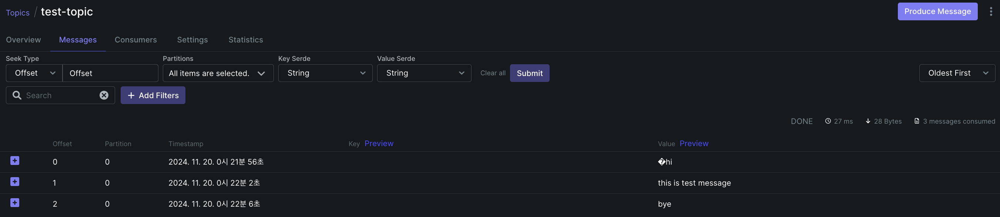
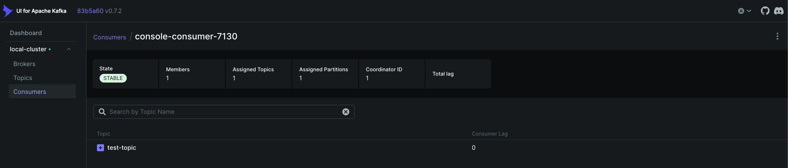
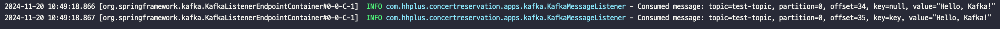

# Kafka 세팅 및 spring-kafka 테스트

---

## 목차
* [Kafka 환경 구성 및 테스트](#kafka-환경-구성-및-테스트)
* [Spring Boot 에서 Kafka 사용해보기](#spring-boot-에서-kafka-사용해보기)

## Kafka 환경 구성 및 테스트
**1. docker-compose.yml 작성**
```yaml
version: '3.8'
services:
  zookeeper:
    container_name: zookeeper
    image: arm64v8/zookeeper:latest
    networks:
      - concert_system_network
    ports:
      - '2181:2181'
    environment:
      - ALLOW_ANONYMOUS_LOGIN=yes
      - ZOO_TLS_CLIENT_AUTH=none
      - ZOO_TLS_QUORUM_CLIENT_AUTH=none

  kafka:
    container_name: kafka
    image: bitnami/kafka:latest
    networks:
      - concert_system_network
    ports:
      - '9092:9092'
    environment:
      - KAFKA_BROKER_ID=1
      - KAFKA_CFG_ZOOKEEPER_CONNECT=zookeeper:2181
      - ALLOW_PLAINTEXT_LISTENER=yes
      - KAFKA_CFG_LISTENERS=LC://kafka:29092,LX://kafka:9092
      - KAFKA_CFG_ADVERTISED_LISTENERS=LC://kafka:29092,LX://${DOCKER_HOST_IP:-localhost}:9092
      - KAFKA_CFG_LISTENER_SECURITY_PROTOCOL_MAP=LC:PLAINTEXT,LX:PLAINTEXT
      - KAFKA_CFG_INTER_BROKER_LISTENER_NAME=LC
    depends_on:
      - zookeeper

  kafka-ui:
    image: provectuslabs/kafka-ui:latest
    container_name: kafka-ui
    networks:
      - concert_system_network
    ports:
      - "8989:8080"
    restart: always
    depends_on:
      - kafka
    environment:
      - KAFKA_CLUSTERS_0_NAME=local-cluster
      - KAFKA_CLUSTERS_0_BOOTSTRAP_SERVERS=kafka:29092
      - KAFKA_CLUSTERS_0_ZOOKEEPER=zookeeper:2181

networks:
  concert_system_network:
    driver: bridge
```

**2. docker-compose 실행**
```
docker-compose up -d
```


**3. Kafka 컨테이너 접속**
```
docker exec -it kafka /bin/bash
```

**4. Kafka 테스트 토픽 생성 및 확인**
```
kafka-topics.sh --bootstrap-server kafka:29092 --create --topic test-topic --partitions 1 --replication-factor 1
kafka-topics.sh --bootstrap-server kafka:29092 --list 
```

**5. 메시지 프로듀싱**
```
kafka-console-producer.sh --bootstrap-server kafka:29092 --topic test-topic
```



**6. 메시지 컨슈밍**
- 토픽에 있는 메시지를 처음부터 읽어오기 위해 `--from-beginning` 옵션을 사용
```
kafka-console-consumer.sh --bootstrap-server kafka:29092 --topic test-topic --from-beginning
```


<br>

## Spring Boot 에서 Kafka 사용해보기

**1. spring-kafka 의존성 추가**
```
dependencies {
    // kafka
    implementation 'org.springframework.kafka:spring-kafka'
}
```

**2. kafka producer config 추가**
```java
@Configuration
public class KafkaProducerConfig {

    @Bean
    public ProducerFactory<String, String> producerFactory() {
        Map<String, Object> props = new HashMap<>();
        props.put(ProducerConfig.BOOTSTRAP_SERVERS_CONFIG, "localhost:9092");
        props.put(ProducerConfig.KEY_SERIALIZER_CLASS_CONFIG, StringSerializer.class);
        props.put(ProducerConfig.VALUE_SERIALIZER_CLASS_CONFIG, StringSerializer.class);
        return new DefaultKafkaProducerFactory<>(props);
    }

    @Bean
    public KafkaTemplate<String, String> kafkaTemplate() {
        return new KafkaTemplate<>(producerFactory());
    }
}
```
```properties
spring.kafka.producer.bootstrap-servers=localhost:9092
spring.kafka.producer.key-serializer=org.apache.kafka.common.serialization.StringSerializer
spring.kafka.producer.value-serializer=org.apache.kafka.common.serialization.StringSerializer
```

**3. kafka consumer config 추가**
```java
@Configuration
public class KafkaConsumerConfig {
    @Bean
    public KafkaListenerContainerFactory<ConcurrentMessageListenerContainer<String, String>> kafkaListenerContainerFactory() {
        ConcurrentKafkaListenerContainerFactory<String, String> factory = new ConcurrentKafkaListenerContainerFactory<>();
        factory.setConsumerFactory(consumerFactory());
        factory.setConcurrency(2);
        factory.getContainerProperties().setAckMode(ContainerProperties.AckMode.MANUAL);
        return factory;
    }

    @Bean
    public ConsumerFactory<String, String> consumerFactory() {
        return new DefaultKafkaConsumerFactory<>(consumerConfig());
    }

    @Bean
    public Map<String, Object> consumerConfig() {
        Map<String, Object> props = new HashMap<>();
        props.put(ConsumerConfig.BOOTSTRAP_SERVERS_CONFIG, "localhost:9092");
        props.put(ConsumerConfig.VALUE_DESERIALIZER_CLASS_CONFIG, StringDeserializer.class);
        props.put(ConsumerConfig.KEY_DESERIALIZER_CLASS_CONFIG, StringDeserializer.class);
        props.put(ConsumerConfig.AUTO_OFFSET_RESET_CONFIG, "earliest");
        props.put(ConsumerConfig.ENABLE_AUTO_COMMIT_CONFIG, false);
        return props;
    }
}
```

```properties
spring.kafka.consumer.bootstrap-servers=localhost:9092
spring.kafka.consumer.key-deserializer=org.apache.kafka.common.serialization.StringDeserializer
spring.kafka.consumer.value-deserializer=org.apache.kafka.common.serialization.StringDeserializer
spring.kafka.consumer.auto-offset-reset=earliest
spring.kafka.consumer.enable-auto-commit=false
```


**4. 테스트 producer 생성**
```java
@Component
@RequiredArgsConstructor
public class KafkaMessageProducer {
    private final KafkaTemplate<String, String> kafkaTemplate;
    private final ObjectMapper objectMapper;

    public <T> void send(String topic, T message) {
        try {
            String json = objectMapper.writeValueAsString(message);
            kafkaTemplate.send(topic, json);
        } catch (JsonProcessingException e) {
            throw new RuntimeException("Failed to serialize message", e);
        }
    }

    public <T> void send(String topic, String key, T message) {
        try {
            String json = objectMapper.writeValueAsString(message);
            kafkaTemplate.send(topic, key, json);
        } catch (JsonProcessingException e) {
            throw new RuntimeException("Failed to serialize message", e);
        }
    }

    // 테스트용
    @PostConstruct
    public void init() {
        send("test-topic", "Hello, Kafka!");
        send("test-topic", "key", "Hello, Kafka! with key");
    }
}
```

**4. 테스트 consumer 생성**
```java
@Component
@Slf4j
public class KafkaMessageConsumer {

    @KafkaListener(groupId = "myGroup", topics = "test-topic")
    public void test(ConsumerRecord<String, String> data, Acknowledgment acknowledgment, Consumer<String, String> consumer){
        log.info("Consumed message: topic={}, partition={}, offset={}, key={}, value={}",
                data.topic(), data.partition(), data.offset(), data.key(), data.value());
        acknowledgment.acknowledge();
    }
}
```
- 애플리케이션 실행 시 `test-topic`에 메시지를 전송하고, 해당 메시지를 컨슈밍하는 것을 확인할 수 있다.
