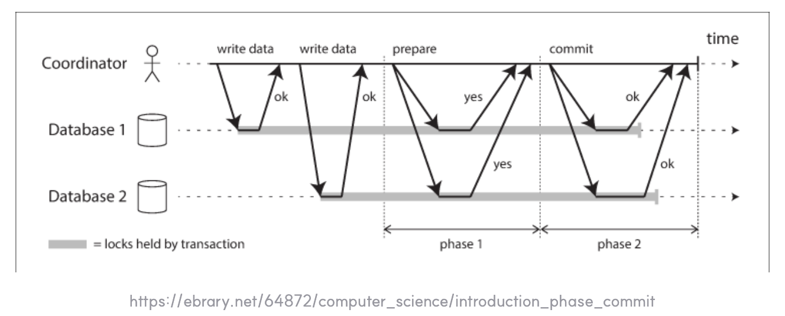
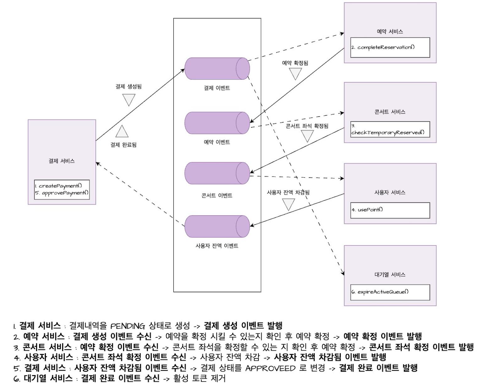

# MSA로 전환을 위한 서비스 분리 및 트랜잭션 처리 방안 설계

---

## 목차

* [개요](#개요)
* [기존 시스템 분석 및 트랜잭션 범위](#주요-기능-및-트랜잭션-범위-분석)
  + [트랜잭션이란?](#트랜잭션이란)
* [서비스 분리 설계](#서비스-분리-설계)
  + [좌석 예약](#좌석예약)
  + [결제](#결제)
* [트랜잭션 처리의 한계](#트랜잭션-처리의-한계)

---

## 개요
기존 단일 서비스 구조에서 MSA로 전환하여 서비스의 확장성을 확보하려면 어떻게 할지 설계해 보고 이 과정에서 발생할 수 있는 트랜잭션 처리 문제와 그 해결 방안을 고려해 본다.

---

## 주요 기능 및 트랜잭션 범위 분석

### 트랜잭션이란?
- 데이터베이스의 상태를 변화시키기 위해 수행하는 작업의 단위
- ACID 특성을 만족해야 한다.
  - **Atomicity(원자성)**: 트랜잭션의 모든 작업이 성공하거나 실패해야 한다.
  - **Consistency(일관성)**: 트랜잭션이 완료된 후 데이터베이스는 일관된 상태여야 한다.
  - **Isolation(독립성)**: 트랜잭션은 다른 트랜잭션에 영향을 받지 않아야 한다.
  - **Durability(지속성)**: 트랜잭션이 성공적으로 완료되면 그 결과는 영구적으로 반영되어야 한다.


### 주요 기능
현재 서비스 구조는 모놀리식 아키텍처로 구성되어 있고 다음과 같은 주요 기능을 제공한다.

- **콘서트 좌석 예약**
  ```
  콘서트 좌석 예약_TX() {
    사용자_조회();
    콘서트_좌석_조회/임시_예약_처리();
    try {
      데이터_플랫폼_전송();
    } catch (Exception e) {
      log.error("데이터 플랫폼 전송 실패: {}", e.getMessage());
    }
  }
  ```
  - 사용자 조회, 콘서트 좌석 조회 및 임시 예약 처리, 데이터 플랫폼 전송 로직이 하나의 트랜잭션으로 묶여 있다.
  - 문제점
    - 모든 작업이 하나의 트랜잭션 안에서 이루어져 데드락이나 타임아웃 발생 가능성이 높다.
    - 데이터 플랫폼 전송 실패 시 에러가 발생하지 않도록 따로 로직을 추가해야 한다.
    - 데이터 플랫폼 전송이 오래 걸리면 사용자 요청 응답 시간이 길어져 사용자 경험이 저하될 수 있다.
    - 데이터 플랫폼 전송 로직이 콘서트 예약 로직과 섞여 있어 관심사가 분리되지 않아 유지보수 및 가독성이 떨어진다.

  <br>

  - 아래와 같이 Spring Event 를 사용하여 데이터 플랫폼 전송을 비동기로 처리할 수 있다.
    ```
    콘서트 좌석 예약_TX() {
      사용자_조회();
      콘서트_좌석_조회/임시_예약_처리();
      콘서트 좌석 예약됨 이벤트 발행();
    }
    
    @Async
    @TransactionalEventListener(phase = TransactionPhase.AFTER_COMMIT)
    데이터 플랫폼 전송_TX(콘서트 좌석 예약됨 이벤트 event) {
        try {
          데이터_플랫폼_전송();
        } catch (Exception e) {
          log.error("데이터 플랫폼 전송 실패: {}", e.getMessage());
          // 재시도 로직 추가 가능 (예: 메시지 큐, 스케줄러 등)
        }
    }
    ```
    - `@Async` 어노테이션을 사용하여 비동기로 처리한다.
    - 단일 애플리케이션에서는 Spring Event 를 사용하여 해결할 수 있지만, 서비스가 분리된 환경에서는 추가적인 메시지 브로커가 필요하다.
    - 장점
      - 데이터 플랫폼 전송 로직을 별도의 메서드로 분리하여 **관심사를 분리**할 수 있다. (느슨한 결합)
      - 메인 트랜잭션에서 데이터 플랫폼 전송을 제거하여 사용자 요청에 대한 응답 속도를 개선할 수 있다.
      - 이벤트 기반 구조로 변경하여 새로운 기능 추가 시 기존 코드를 수정할 필요 없이 확장 가능하다.
      - 예약 처리와 데이터 플랫폼 전송을 별도의 트랜잭션으로 분리하여 독립적으로 실패를 처리할 수 있다.

<br>

- **콘서트 예약 건 결제**
  ```
  결제_TX() {
    결제_가능여부_체크();
    유저_포인트_차감();
    결제처리();
    예약_및_좌석_상태_변경();
    토큰_만료_처리();
  }
  ```
  - 결제 가능 여부 체크, 유저 포인트 차감, 결제 처리, 예약 및 좌석 상태 변경, 토큰 만료 처리 로직이 하나의 트랜잭션으로 묶여 있다.
  - 모든 작업이 하나의 트랜잭션 안에서 이루어지기 때문에 트랜잭션이 길어질 수 있다.
  - 토큰 만료 처리는 결제의 관심사가 아니므로 따로 분리되어야 한다.
    - 위의 예시와 같이 Spring Event 를 사용하여 비동기로 처리가 가능하다.

---

<br>

## 서비스 분리 설계 및 트랜잭션 처리 방안

### 서비스 분리 및 주요 담당 업무
- **`콘서트 서비스`**: 콘서트 정보 조회, 좌석 예약
- **`결제 서비스`**: 결제 승인/취소 처리, 결제 이력 관리
- **`사용자 서비스`**: 사용자 정보 조회, 사용자 잔액 조회, 사용자 잔액 충전/차감
- **`예약 서비스`**: 예약 상태 관리, 예약 이력 관리
- **`대기열 서비스`**: 대기열 생성, 대기열 조회, 대기열 만료 처리

### 콘서트 예약 건 결제 - 서비스 분리 설계
```

결제처리_TX() {
    결제_정보_조회(); 
    결제_이력_생성();
}

사용자_잔액_차감_TX() {
    사용자_잔액_조회();
    사용자_잔액_차감();
}

예약_처리_TX() {
    예약_상태_변경();
}

좌석_예약_상태_변경_TX() {
    좌석_예약_상태_변경();
}

토큰_만료_처리_TX() {
    토큰_만료_처리();
}
```
<br>

### MSA 환경(분산 환경)에서의 트랜잭션 처리 한계
- 각각의 서비스마다 자체 DB 를 가지고 있는 **Database Per Service 패턴**을 사용한다면 각 서비스의 트랜잭션은 서로 다른 데이터베이스에 대해 수행된다.
- 이는 단일 데이터베이스 내에서 이루어지는 로컬 트랜잭션과 달리 ACID 특성을 보장하기 어려운 환경을 만든다.
- 예를 들어, 예약 서비스와 결제 서비스, 유저 서비스가 있다고 가정해보자
  ```
    - 콘서트 좌석 예약 건 결제
    - 예약 서비스는 예약을 확정 지음
    - 유저 서비스는 유저의 잔액을 차감
  ```
  - 이 경우, 3개의 서비스가 각각의 로컬 트랜잭션을 사용하기 때문에, `전체 트랜잭션의 일관성을 보장하기 어렵다.`
  - 네트워크 장애, 서비스 중단 등의 문제로 인해 예약 상태 변경은 성공했지만 결제가 실패하는 데이터 불일치 문제가 발생할 수 있다.


- 이러한 문제를 해결하기 위해 다양한 방법이 제안되고 있다.
  - 이 중에서 대표적인 방법으로 `2PC (Two-Phase Commit) 패턴`과 `SAGA 패턴` 이 있다.

---

## 해결방안

### 2PC (Two-Phase Commit) 패턴
- **2PC (Two-Phase Commit)** 패턴은 분산 환경에서의 트랜잭션을 관리하기 위한 방법 중 하나이다.
- 2PC는 코디네이터와 여러 데이터베이스 간의 합의를 통해 트랜잭션 커밋/롤백이 결정된다.
```
  - 원자성 보장: 2PC의 핵심은 여러 데이터베이스나 서비스에 걸쳐 있는 트랜잭션도 하나의 트랜잭션처럼 다룰 수 있게 해준다는 것이다.
  즉, 모든 작업이 성공적으로 수행되거나 아무 작업도 수행되지 않은 것처럼 보장한다.
  
  - 코디네이터의 중요성: 코디네이터는 분산 트랜잭션을 관리하고 조율하는 중요한 역할을 한다.
  모든 작업의 상태를 모니터링하고, 최종 커밋 또는 롤백 결정을 내린다.
```


1. **준비 단계 (Phase 1)**
   - 트랜잭션 조정자(Coordinator)는 모든 참여자(Participant)에게 트랜잭션을 수행할 준비가 되었는지 확인하기 위해 prepare 요청을 보낸다. 
   - 각 참여자는 로컬 트랜잭션을 준비하고, 성공적으로 수행할 수 있으면 **yes**를, 수행할 수 없으면 **no**를 응답한다.
   - **모든 참여자가 yes**라고 응답하면, 조정자는 Phase 2로 넘어가 "commit" 요청을 준비한다.
   - **참여자 중 하나라도 "no"**를 응답하면, 조정자는 Phase 2로 넘어가지 않고 즉시 "abort" 요청을 보낸다.
2. **커밋 단계 (Phase 2)**
   - 모든 참여자가 "yes"라고 응답하면, 조정자는 모든 참여자에게 트랜잭션을 커밋하라고 요청한다.
   - 만약 한 명이라도 "no"를 응답하거나 장애가 발생하면, 조정자는 모든 참여자에게 트랜잭션을 롤백하라고 요청한다.

- 이를 가능하게 하는 기술 중 하나는 글로벌하게 Unique한 트랜잭션 ID이다. 
- Coordinator가 Prepare 요청 단계에서 모든 트랜잭션 참여자에게 글로벌 트랜잭션 ID를 함께 보내고, 이러한 요청 중 하나라도 실패하게 되면 Coordinator는 모든 트랜잭션 참여자들에게 해당 트랜잭션 ID의 트랜잭션에 대해 Abort 요청을 보내게 된다.

- **장점**:
  - 모든 작업이 성공적으로 수행되거나 아무 작업도 수행되지 않은 것처럼 보장한다.
  - 데이터 일관성을 보장한다.
- **단점**:
  - 2PC는 코디네이터에 의존적이어서, 코디네이터 장애 시 모든 트랜잭션 참여자가 커밋/롤백 여부를 스스로 결정할 수 없다.
  - 2PC는 참여자가 많아질수록 복잡도가 증가한다.
  - 2PC는 블로킹 방식으로 동작하므로, 참여자 중 하나가 응답을 하지 않으면 전체 트랜잭션이 블로킹된다.
  - NoSQL 등 일부 DBMS가 지원하지 않으면 사용할 수 없다.

<br>  

### SAGA 패턴
- 분산 시스템에서 롱 러닝 트랜잭션을 관리하기 위해 사용하는 패턴이다.
- 2PC와는 달리, 각 서비스에서 로컬 트랜잭션을 수행하며, 트랜잭션 간의 순서를 통해 전체 트랜잭션의 일관성을 유지한다.
- 주로 최종 일관성을 요구하는 시스템에서 사용된다.

#### 동작 방식
- 연속된 로컬 트랜잭션: 트랜잭션은 여러 단계로 나누어지며, 각 단계는 해당 서비스의 로컬 트랜잭션으로 처리된다.
- 보상 트랜잭션 (Compensating Transactions): 어떤 단계에서 실패하면, 이전 단계로 돌아가 보상 트랜잭션을 수행하여 상태를 되돌린다.


#### 코레오그래피 기반 사가 (Choreography-based Saga)
- 각 서비스는 트랜잭션이 완료되면 완료 이벤트를 발행한다. 다음 로컬 트랜잭션을 수행해야 할 서비스는 해당 이벤트를 구독하고 이어서 실행한다. 중간에 로컬 트랜잭션이 실패하면, 보상 트랜잭션 이벤트를 발생시켜 롤백을 시도한다.
- 각 서비스가 단일 트랜잭션을 수행하고, 이벤트 기반으로 다음 서비스의 트랜잭션을 호출하는 방식이다.
- 의사 결정과 순서화를 사가 참여자에게 맡긴다. 사가 참여자는 주로 이벤트 교환 방식으로 통신한다.
- 전체 트랜잭션의 흐름을 관리하는 중앙 조정자가 없으며, 서비스 간의 이벤트 흐름에 따라 트랜잭션이 진행됩니다.
- **콘서트 좌석 예약 건 결제 예시**
  

- **장점**:
  - 중앙 조정자가 없어 단일 실패 지점(Single Point of Failure)이 없으며, 서비스들이 독립적으로 실행될 수 있습니다.
  - 서비스가 추가되거나 변경되어도 중앙 조정자를 수정할 필요가 없어 확장성이 좋다.
  - 각 서비스는 서로에 대해 몰라도 되고 이벤트만 이해하면 되므로, 느슨한 결합이 가능하다.
- **단점**:
  - 이벤트 기반으로 연결된 서비스 중 하나가 실패할 경우, 복잡한 롤백 처리가 필요하다.
  - 중앙에서 전체 트랜잭션을 모니터링할 수 없어, 트랜잭션 흐름을 추적하기 어렵다.
  - 이벤트가 많아질수록 메시지 큐나 이벤트 버스에 부하가 발생할 수 있다.
  - 참가자가 많아질수록 트랜잭션의 복잡도가 증가한다.


#### 오케스트레이션 기반 사가 (Orchestration-based Saga)
- 사가 편성 로직을 사가 오케스트레이터에 중앙화한다.
- 사가 오케스트레이터는 사가 참여자에게 커맨드 메시지를 보내 수행할 작업을 지시한다.
- 오케스트레이터는 각 단계의 성공 여부를 모니터링하고, 실패 시 보상 트랜잭션을 발생시켜 롤백을 시도한다.
- 트랜잭션 조정자는 각 서비스의 작업을 순서대로 호출하고, 오류가 발생할 경우 보상 트랜잭션을 수행하도록 지시한다.
- **콘서트 좌석 예약 건 결제 예시**
  

- **장점**
  - 트랜잭션의 전체 흐름을 중앙에서 쉽게 제어하고 모니터링할 수 있습니다.
  - 오케스트레이터가 상태를 관리하므로, 트랜잭션이 실패할 경우 보상 트랜잭션 등을 쉽게 수행할 수 있습니다.
  - 서비스 간 결합도가 낮다.
- **단점**
  - 오케스트레이터에 장애가 발생하면 전체 트랜잭션이 중단될 수 있다.
  - 중앙 조정자의 역할이 커질수록 트랜잭션 병목이 발생할 가능성이 있다.
  - 확장성과 유연성이 낮아질 수 있다.

SAGA 패턴의 트랜잭션은 격리되지 않는다. 데이터베이스 트랜잭션은 ACID 를 보장하지만, SAGA 패턴에서의 트랜잭션은 Isolation을 보장하지 않기 때문에 이를 보완하기 위한 설계가 필요하다.


---
## 결론
- MSA로 전환하기 위해서는 서비스를 적절하게 분리하고, 트랜잭션 처리 방안을 고려해야 한다.
- 2PC 패턴은 전체 트랜잭션의 일관성을 보장하지만, 복잡도가 높고 블로킹 문제가 발생할 수 있다.
- SAGA 패턴은 각 서비스의 로컬 트랜잭션을 순차적으로 수행하며, 보상 트랜잭션을 통해 롤백을 처리한다.
- SAGA 패턴은 중앙 조정자가 없는 코레오그래피 기반과 중앙 조정자가 있는 오케스트레이션 기반으로 나뉘며, 각각의 장단점이 있다.
- SAGA 패턴은 격리되지 않는 트랜잭션을 사용하므로, 데이터 일관성을 보장하기 위한 추가적인 설계가 필요하다.
- 서비스 분리 및 트랜잭션 처리 방안을 고려하여 MSA로 전환하면, 서비스의 확장성과 유연성을 확보할 수 있다.
- 트랜잭션 처리 방안을 선택할 때, 시스템의 요구사항과 환경에 맞게 적절한 방법을 선택해야 한다.


## 참고
- [분산 트랜잭션 관리:2PC&SAGA 패턴](https://velog.io/@ch200203/MSA-%ED%99%98%EA%B2%BD%EC%97%90%EC%84%9C%EC%9D%98-%EB%B6%84%EC%82%B0-%ED%8A%B8%EB%9E%9C%EC%9E%AD%EC%85%98-%EA%B4%80%EB%A6%AC2PC-SAGA-%ED%8C%A8%ED%84%B4)
- [SAGA 패턴](https://microservices.io/patterns/data/saga.html)
- [분산 트랜잭션과 2PC, SAGA 패턴] (https://velog.io/@ch200203/MSA-%ED%99%98%EA%B2%BD%EC%97%90%EC%84%9C%EC%9D%98-%EB%B6%84%EC%82%B0-%ED%8A%B8%EB%9E%9C%EC%9E%AD%EC%85%98-%EA%B4%80%EB%A6%AC2PC-SAGA-%ED%8C%A8%ED%84%B4)