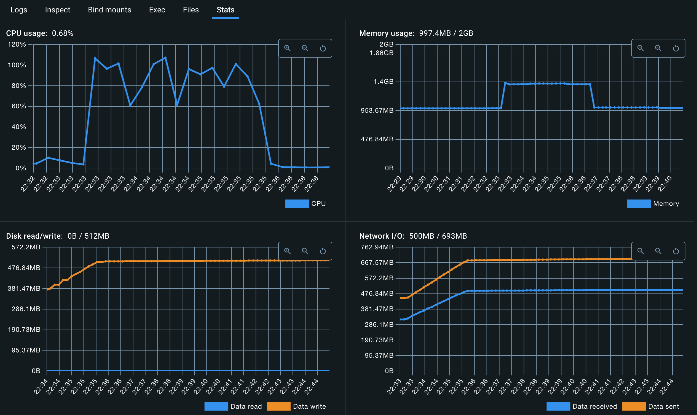
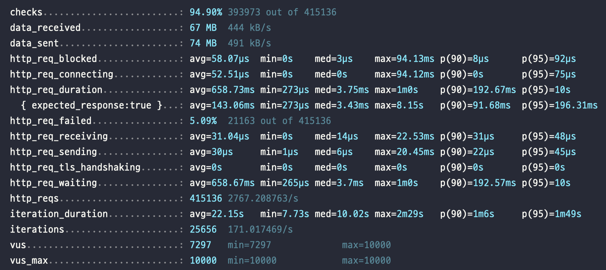
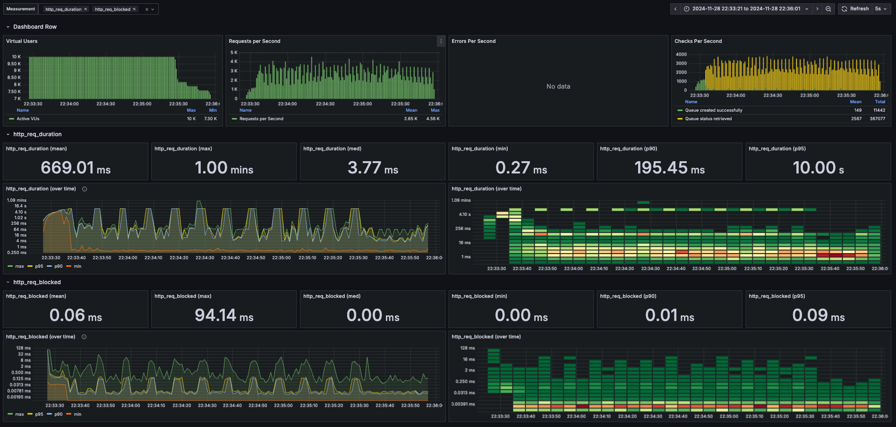
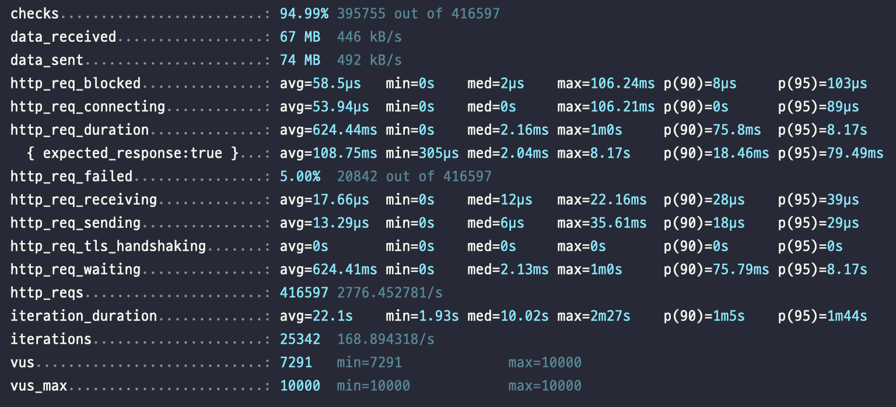
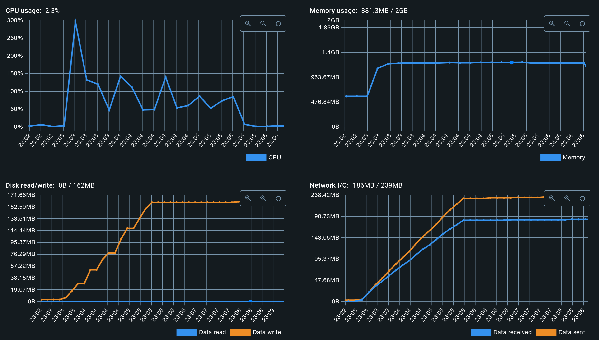
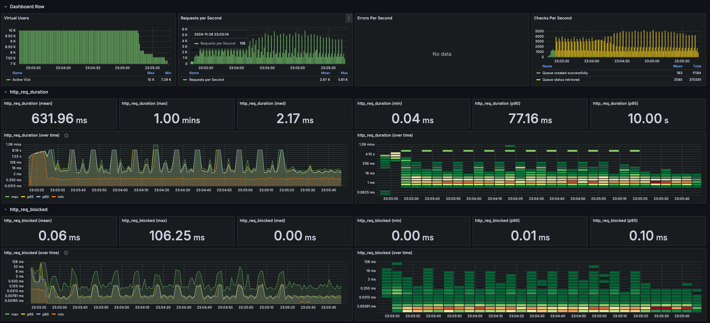
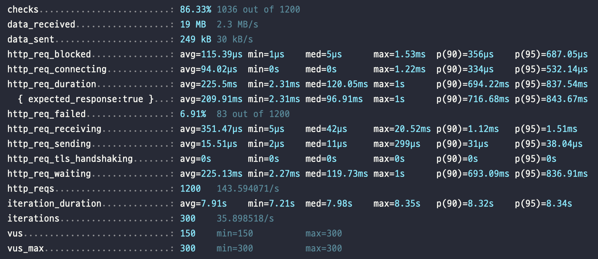
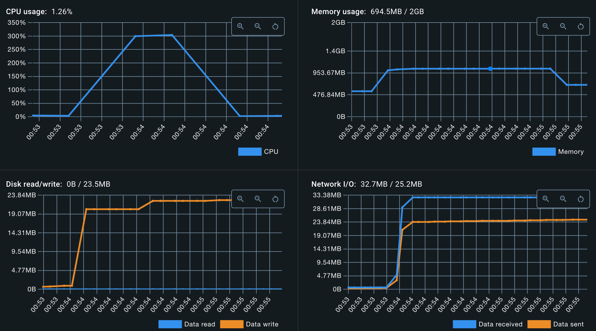

# 콘서트 대기열 서비스 성능 테스트 및 장애 대응 보고서

---

## 목차

## 성능 테스트 지표

---
### 1. TPS(Transaction Per Second)
- 시스템이 얼마나 많은 트랜잭션을 처리할 수 있는지를 나타내는 지표
- 시스템의 처리량을 나타내는 지표
- TPS = (시스템이 처리한 트랜잭션 수) / (시스템이 처리한 시간)
- TPS가 높을수록 시스템의 처리량이 높다고 볼 수 있다.

### 2. Latency(지연 시간)
- 시스템이 요청을 받고 응답을 보내기까지 걸리는 시간
- 시스템의 응답 속도를 나타내는 지표
- Latency가 낮을수록 시스템의 응답 속도가 빠르다고 볼 수 있다.

### 3. Error Rate(에러율)
- 시스템이 처리한 요청 중 에러가 발생한 비율
- 시스템의 안정성을 나타내는 지표
- Error Rate가 낮을수록 시스템의 안정성이 높다고 볼 수 있다.
- Error Rate = (에러가 발생한 요청 수) / (전체 요청 수)


## 성능 테스트 종류

---
### 1. 부하 테스트(Load Test)
- 시스템이 정상적으로 동작하는지 확인하기 위한 테스트
- 시스템의 최대 처리량을 확인하기 위한 테스트
- 목표 값을 설정하고, 목표값만큼의 부하를 견딜 수 있는지를 테스트한다.

### 2. 스트레스 테스트(Stress Test)
- 시스템이 과부하 상태에서도 정상적으로 동작하는지 확인하기 위한 테스트
- 시스템의 최대 처리량을 넘어서는 부하를 가해 시스템의 성능을 확인한다.

### 3. 중단점 테스트(Breakpoint Test)
- 시스템이 어느 정도의 부하까지 견딜 수 있는지 확인하기 위한 테스트
- 부하를 점진적으로 증가시키며, 시스템이 어느 지점에서 더 이상 동작하지 않는지 확인한다.
- 시스템의 한계를 확인하기 위한 테스트

### 4. 스파이크 테스트(Spike Test)
- 갑작스런 부하가 발생했을 때 시스템이 어떻게 동작하는지 확인하기 위한 테스트
- 이벤트성 부하를 가해 시스템의 성능을 확인한다.


## 성능 테스트를 위한 도구 및 환경 설정

---
### k6
- 성능 테스트를 위한 오픈소스 도구
- Javascript로 테스트 스크립트를 작성하여 성능 테스트를 진행할 수 있다.
- 다양한 프로토콜(HTTP, Websocket, gRPC)을 지원한다.
- CLI(Command Line Interface)를 통해 테스트를 실행할 수 있다.
- 테스트 결과를 다양한 형태로 출력할 수 있다.


### docker-compose.yml 작성
- kafka, zookeeper, kafka-ui, redis, grafana, influxdb, prometheus, concert-service 를 docker-compose.yml 로 구성
- concert-service 는 미리 생성한 docker image를 사용
- concert-service 애플리케이션의 cpu 및 memory 설정을 통해 운영 환경에 가깝게 설정하여 유의미한 테스트를 진행
```yaml
version: '3.8'
services:
  # kafka
  zookeeper:
    container_name: zookeeper
    image: arm64v8/zookeeper:latest
    networks:
      - concert_system_network
    ports:
      - '2181:2181'
    environment:
      - ALLOW_ANONYMOUS_LOGIN=yes
      - ZOO_TLS_CLIENT_AUTH=none
      - ZOO_TLS_QUORUM_CLIENT_AUTH=none

  kafka:
    container_name: kafka
    image: bitnami/kafka:latest
    networks:
      - concert_system_network
    ports:
      - '9092:9092'
    environment:
      - KAFKA_BROKER_ID=1
      - KAFKA_CFG_ZOOKEEPER_CONNECT=zookeeper:2181
      - ALLOW_PLAINTEXT_LISTENER=yes
      - KAFKA_CFG_LISTENERS=LC://kafka:29092,LX://kafka:9092
      - KAFKA_CFG_ADVERTISED_LISTENERS=LC://kafka:29092,LX://${DOCKER_HOST_IP:-localhost}:9092
      - KAFKA_CFG_LISTENER_SECURITY_PROTOCOL_MAP=LC:PLAINTEXT,LX:PLAINTEXT
      - KAFKA_CFG_INTER_BROKER_LISTENER_NAME=LC
    depends_on:
      - zookeeper

  kafka-ui:
    image: provectuslabs/kafka-ui:latest
    container_name: kafka-ui
    networks:
      - concert_system_network
    ports:
      - "8989:8080"
    restart: always
    depends_on:
      - kafka
    environment:
      - KAFKA_CLUSTERS_0_NAME=local-cluster
      - KAFKA_CLUSTERS_0_BOOTSTRAP_SERVERS=kafka:29092
      - KAFKA_CLUSTERS_0_ZOOKEEPER=zookeeper:2181

  # redis
  redis:
    image: redis:latest
    container_name: redis
    ports:
      - "6379:6379"
    networks:
      - concert_system_network
    volumes:
      - ./redis:/data

  # grafana
  grafana:
    container_name: grafana
    image: grafana/grafana:latest
    networks:
      - concert_system_network
    ports:
      - "3000:3000"
    environment:
      - GF_AUTH_ANONYMOUS_ORG_ROLE=Admin
      - GF_AUTH_ANONYMOUS_ENABLED=true
      - GF_AUTH_BASIC_ENABLED=false
    volumes:
      - ./grafana:/etc/grafana/provisioning/

  # influxdb
  influxdb:
    container_name: influxdb
    image: influxdb:1.8
    networks:
      - concert_system_network
    ports:
      - "8086:8086"
    environment:
      - INFLUXDB_DB=k6

  # prometheus
  prometheus:
    image: prom/prometheus
    container_name: prometheus
    networks:
      - concert_system_network
    ports:
      - "9090:9090"
    volumes:
      - ./prometheus.yml:/etc/prometheus/prometheus.yml
    command:
      - '--config.file=/etc/prometheus/prometheus.yml'
      - '--storage.tsdb.path=/prometheus'
      - '--web.enable-lifecycle'
    restart: always
    extra_hosts:
      - "host.docker.internal:host-gateway"


  # application
  concert-service:
    image: hhplus-concert-reservation:0.0.1
    container_name: concert-app
    networks:
      - concert_system_network
    ports:
      - "8080:8080"
    environment:
      - SPRING_DATASOURCE_URL=jdbc:mysql://host.docker.internal:3306/hhplus_concert_reservation?useSSL=false&serverTimezone=UTC&allowPublicKeyRetrieval=true
      - SPRING_DATASOURCE_USERNAME=root
      - SPRING_DATASOURCE_PASSWORD=root
      - SPRING_DATASOURCE_DRIVER_CLASS_NAME=com.mysql.cj.jdbc.Driver
      - SPRING_KAFKA_BOOTSTRAP-SERVERS=kafka:29092
      - SPRING_REDIS_HOST=redis
      - SPRING_REDIS_PORT=6379
    depends_on:
      - kafka
      - redis
    deploy:
      resources:
        limits:
          memory: 2G
          cpus: '3.0'
        reservations:
          memory: 2G
          cpus: '3.0'

networks:
  concert_system_network:
    driver: bridge
```

## 성능 테스트 결과

---

### 시나리오1 : 10,000 명의 사용자가 동시에 대기열을 생성하고 조회한다.
- 대기열 생성 및 조회 시스템의 처리량 및 응답 속도를 확인하기 위한 시나리오
- 대기열 생성 및 조회는 콘서트 예약 서비스의 핵심 기능이다.

#### k6 스크립트1 - 사용자 수를 고정하고 대기열 생성 및 조회
```javascript
import http from 'k6/http';
import {check, sleep} from 'k6';

const host = 'http://localhost:8080'; // 테스트할 서버 URL


// 부하 테스트 옵션 설정
export const options = {
    scenarios: {
        peek_test: {
            executor: 'constant-vus',
            vus: 1,
            duration: '30s'
        },
    },
};

// 대기열 생성 함수
function createQueue(userId) {
    const res = http.post(`${host}/api/v1/waiting-queues`, // 요청 URL
        JSON.stringify({ userId: userId }), // 요청 바디에 랜덤 userId 포함
        {
            headers: { 'Content-Type': 'application/json' }, // JSON 요청 헤더
        }
    );
    check(res, { 'Queue created successfully': (r) => r.status === 201 });
    return JSON.parse(res.body).token;
}

// 대기열 조회 함수
function checkQueue(queueToken) {
    const res = http.get(`${host}/api/v1/waiting-queues`, {
        headers: {
            'accept': 'application/json',
            'QUEUE-TOKEN': queueToken
        }
    });
    check(res, { 'Queue status retrieved': (r) => r.status === 200 });
    return JSON.parse(res.body).status; // 대기열 순번 반환
}

// VU 별로 실행되는 메인 시나리오
export default function () {
    const userId = Math.floor(Math.random() * 1000) + 1; // 1~1000 사이의 랜덤 숫자
    console.log(`User ${userId} is trying to book a concert ticket.`)
    const queueToken = createQueue(userId); // 1. 대기열 생성
    let queueStatus;
    do {
        sleep(3); // 대기열 조회 간격
        queueStatus = checkQueue(queueToken); // 2. 대기열 조회
    } while (queueStatus !== "ACTIVATED"); // 대기열이 활성화 상태가 될 때까지 반복
}
```
- `constant-vus` : 가상 사용자 수를 일정하게 유지하는 방식
- 대기열 생성 및 조회 시스템의 안정성을 확인하기 위한 시나리오
- 한 번에 여러 사용자가 대기열을 생성하고 조회하는 상황을 모방하기 위함


#### 조건 1 - CPU: 1, Memory: 2G




- CPU가 1로 설정되어 있어, 대기열 생성 및 조회 시스템의 처리량이 낮고, 실패하는 경우가 많이 발생했다.
- 주요 지표 
  - **서버 연결 시간 (http_req_connecting)**
    - 서버에 연결하는 데 걸린 평균 시간은 52.51µs 이고, 연결이 거의 즉시 이루어졌다. 
  - **HTTP 요청 응답 시간 (http_req_duration)**
    - HTTP 요청을 보내고 응답을 받는 데 걸린 평균 시간은 658.73ms였다. 
    - P90이 192.67ms, P95은 10s 이며 최대 응답 시간은 1m 이다.
  - 대부분의 요청이 1초 이내에 완료되었다.
  - **서버 응답 대기 시간 (http_req_waiting)**
    - 서버에서 응답을 기다리는 데 걸린 평균 시간은 658.67ms 이다.


#### 조건 2 - CPU: 3, Memory: 2G



- CPU가 3으로 설정되어 있어, 1로 설정했을 때보다 대기열 생성 및 조회 시스템의 처리량이 높아졌다.
- 주요 지표
    - **서버 연결 시간 (http_req_connecting)**
        - 서버에 연결하는 데 걸린 평균 시간은 53.94µs 이고, 연결이 거의 즉시 이루어졌다.
    - **HTTP 요청 응답 시간 (http_req_duration)**
        - HTTP 요청을 보내고 응답을 받는 데 걸린 평균 시간은 624.44ms였다.
        - P90이 75.8ms, P95은 8.17s 이며 최대 응답 시간은 1m 이다.
    - 대기열이 활성화 될 때까지 조회하기 때문에 시간이 많이 소요된다.
    - 대부분의 요청이 1초 이내에 완료되었다.
    - **서버 응답 대기 시간 (http_req_waiting)**
        - 서버에서 응답을 기다리는 데 걸린 평균 시간은 624.41ms 이다.

- 위의 테스트를 통해 cpu 수가 성능에 미치는 영향을 확인할 수 있었다.


### 시나리오2 : 300명의 사용자가 동시에 세션 조회, 좌석 조회, 예약, 결제 프로세스를 진행한다.
- 세션 조회, 좌석 조회, 예약, 결제 프로세스를 진행하는 시나리오
- 대기열로 앞에서 동시 접속자를 제한하기 때문에 VUser를 300명으로 설정하여 진행
- 미리 활성 토큰을 생성하여 사용자별로 토큰을 부여한 후 테스트 진행

#### k6 스크립트 - 사용자 수를 고정하고 세션 조회, 좌석 조회, 예약, 결제 프로세스 진행
```javascript
import http from 'k6/http';
import { check, sleep } from 'k6';


const host = 'http://localhost:8080'; // 테스트할 서버 URL

export const options = {
    scenarios: {
        concert_booking: {
            executor: 'per-vu-iterations',  // 각 가상 사용자별로 반복 횟수 설정
            vus: 300,  // 300명의 가상 사용자
            iterations: 1  // 각 가상 사용자가 1번만 실행
        },
    },
};

// 콘서트 회차 조회 함수
function getConcertSession(queueToken) {
    const res = http.get(`${host}/api/v1/concerts/1/sessions`, {
        headers: {
            'accept': 'application/json',
            'QUEUE-TOKEN': queueToken
        }
    });
    check(res, { 'Concert schedule retrieved': (r) => r.status === 200 });
    const sessions = JSON.parse(res.body).sessions;
    // sessions 배열에서 랜덤으로 하나의 세션을 선택하여 리턴
    const randomSession = sessions[Math.floor(Math.random() * sessions.length)];
    return randomSession.sessionId;
}

// 콘서트 좌석 조회 함수
function getAvailableSeat(sessionId, queueToken) {
    const res = http.get(`${host}/api/v1/concerts/1/sessions/${sessionId}/seats`, {
        headers: {
            'accept': 'application/json',
            'QUEUE-TOKEN': queueToken
        }
    });
    check(res, { 'Seat availability retrieved': (r) => r.status === 200 });
    const availableSeats = JSON.parse(res.body).availableSeats;
    const randomCount = Math.floor(Math.random() * 2) + 1; // 1~2 사이의 랜덤 숫자
    const shuffledSeats = availableSeats.sort(() => 0.5 - Math.random()); // 좌석 배열 섞기
    const selectedSeats = shuffledSeats.slice(0, Math.min(randomCount, shuffledSeats.length)); // 가능한 개수만큼 선택
    return selectedSeats.map(seat => seat.seatId);
}

// 콘서트 예약 함수
function reserveSeat(userId, sessionId, seatIds, queueToken) {
    const res = http.post(`${host}/api/v1/concerts/1/sessions/${sessionId}/reservations`, JSON.stringify({
        userId: userId,
        seatIds: seatIds
    }), {
        headers: {
            'accept': 'application/json',
            'Content-Type': 'application/json',
            'QUEUE-TOKEN': queueToken
        }
    });
    check(res, { 'Seat reserved successfully': (r) => r.status === 201 });
    return JSON.parse(res.body).reservationId;
}

// 예약 결제 함수
function makePayment(userId, reservationId, queueToken) {
    const res = http.post(`${host}/api/v1/payments`, JSON.stringify({
        userId: userId,
        reservationId: reservationId
    }), {
        headers: {
            'accept': 'application/json',
            'Content-Type': 'application/json',
            'QUEUE-TOKEN': queueToken
        }
    });
    check(res, { 'Payment successful': (r) => r.status === 201 });
}

// VU 별로 실행되는 메인 시나리오
export default function () {
    const userId = `${__VU}`;
    const queueToken = `queue_token_${__VU}`; // VU별로 토큰을 순차적으로 생성

    console.log(`User ${userId} is trying to book a concert ticket.`);

    // 랜덤으로 쉬기 (1~3초)

    const sessionId = getConcertSession(queueToken); // 3. 콘서트 회차 조회

    sleep(3);

    const seatIds = getAvailableSeat(sessionId, queueToken); // 4. 콘서트 좌석 조회

    sleep(2);

    const reservationId = reserveSeat(userId, sessionId, seatIds, queueToken); // 5. 콘서트 예약

    sleep(2);

    makePayment(userId, reservationId, queueToken); // 6. 결제*!/*/
}
```
- `per-vu-iterations` : 각 가상 사용자별로 반복 횟수를 설정하는 방식
- 세션 조회, 좌석 조회, 예약, 결제 프로세스를 진행하는 시나리오
- 한 번에 여러 사용자가 세션 조회, 좌석 조회, 예약, 결제 프로세스를 진행하는 상황을 나타낸다.



- 주요 지표
    - **서버 연결 시간 (http_req_connecting)**
        - 서버에 연결하는 데 걸린 평균 시간은 94.02µs 이고, 연결이 거의 즉시 이루어졌다.
    - **HTTP 요청 응답 시간 (http_req_duration)**
        - HTTP 요청을 보내고 응답을 받는 데 걸린 평균 시간은 225.5ms였다.
        - P90이 794.22ms, P95은 837.54ms 이며 최대 응답 시간은 1s 이다.
    - 대부분의 요청이 1초 이내에 완료되었다.
    - **서버 응답 대기 시간 (http_req_waiting)**
        - 서버에서 응답을 기다리는 데 걸린 평균 시간은 225.13ms 이다.
- 요약
    - 대부분 요청이 1초 이내에 처리되었으며, 응답 시간이 빠르다.
    - 서버 응답 대기 시간이 225.13ms로 빠르게 처리되었다.


## 참고

---
- [성능테스트 - 성능 테스트의 목적 / 종류 / 지표 / 용어 정리](https://dewble.tistory.com/entry/concept-of-performance-test)
