### 목록

---
1. [대기열 발급 요청](#1-대기열-발급-요청)
2. [대기열 조회 요청](#2-대기열-조회-요청)
3. [콘서트 예약 가능 회차(날짜) 조회](#3-콘서트-예약-가능-회차-조회)
4. [콘서트 회차 좌석 조회](#4-콘서트-회차-좌석-조회)
5. [콘서트 회차의 좌석 예약](#5-콘서트-회차의-좌석-예약)
6. [결제](#6-결제)
7. [잔액 충전](#7-잔액-충전)
8. [잔액 조회](#8-잔액-조회)
9. [대기열 활성/만료 스케줄링](#9-대기열-활성만료-스케줄링)
10. [임시 예약 좌석 만료 스케줄링](#10-임시-예약-좌석-만료-스케줄링)

 

### 1. 대기열 발급 요청

---

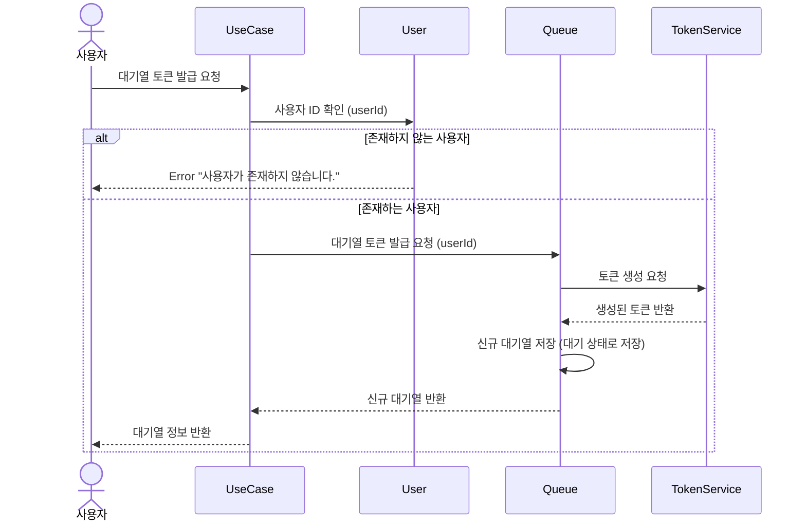
### Description
대기열 토큰 발급 요청에 대한 시퀀스 다이어그램입니다.

- 사용자가 대기열 토큰을 발급 요청하면, 시스템은 해당 사용자가 존재하는지 확인합니다.
- 사용자가 존재하지 않는 경우 에러 메시지를 반환합니다.
- 대기열 새로 토큰 발급하여 대기열에 저장합니다. 이때, 대기열 상태는 '대기'로 저장합니다.
- 대기열 정보를 사용자에게 반환합니다.

 

### 2. 대기열 조회 요청

---
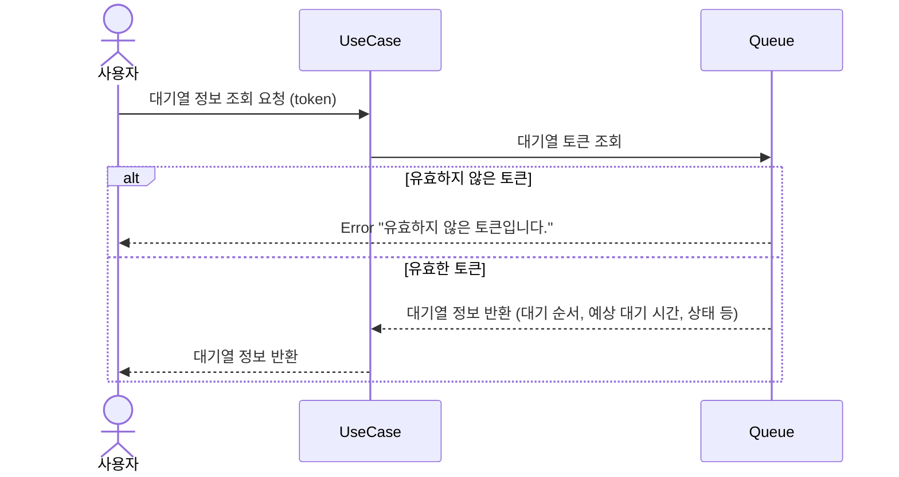

### Description
대기열 정보 조회 요청에 대한 시퀀스 다이어그램입니다.

- 사용자가 대기열 정보 조회 요청하면, 시스템은 해당 토큰이 유효한지 확인합니다.
- 토큰이 유효하지 않은 경우 에러 메시지를 반환합니다.
- 대기열 정보를 조회하여 대기 순서, 상태 등의 정보를 사용자에게 반환합니다.

 

### 3. 콘서트 예약 가능 회차 조회

---
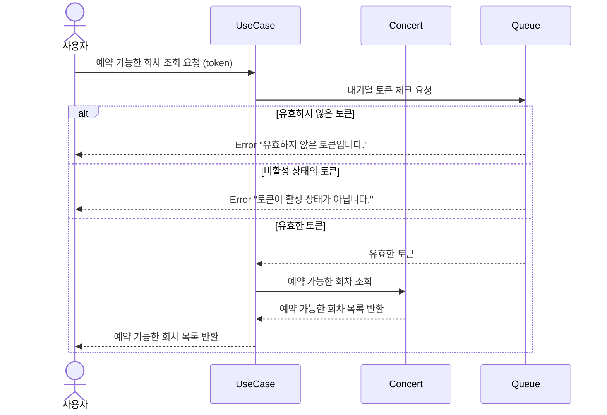

### Description
콘서트 예약 가능 날짜 조회 요청에 대한 시퀀스 다이어그램입니다.

- 사용자가 대기열 토큰을 포함해 예약 가능한 회차를 조회 요청하면, 시스템은 해당 토큰이 유효한지 확인합니다.
- 토큰이 유효하지 않은 경우 에러 메시지를 반환합니다.
- 토큰이 활성 상태가 아닌 경우 에러 메시지를 반환합니다.
- 예약 가능한 회차 목록을 조회하여 사용자에게 반환합니다.
- 예약 가능한 회차 목록은 콘서트 일시, 잔여 좌석 수 등의 정보를 포함합니다.

 

### 4. 콘서트 회차 좌석 조회

---
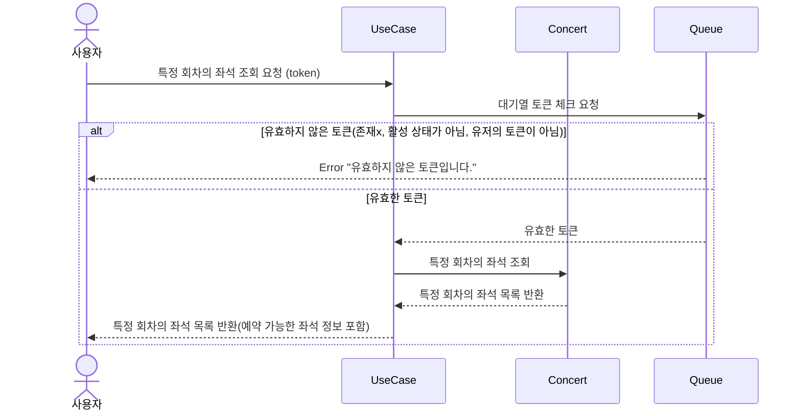

### Description
콘서트 회차의 좌석 조회 요청에 대한 시퀀스 다이어그램입니다.

- 사용자가 대기열 토큰을 포함해 특정 회차의 좌석을 조회 요청하면, 시스템은 해당 토큰이 유효한지 확인합니다.
- 토큰이 유효하지 않은 경우 에러 메시지를 반환합니다.
- 토큰이 활성 상태가 아닌 경우 에러 메시지를 반환합니다.
- 특정 회차의 좌석 목록을 조회하여 사용자에게 반환합니다.
- 좌석 목록은 좌석 번호, 가격, 상태 등의 정보를 포함합니다.
  - 좌석 상태는 '임시 예약', '예약 가능', '판매 완료' 등으로 구분됩니다.

 

### 5. 콘서트 회차의 좌석 예약

---
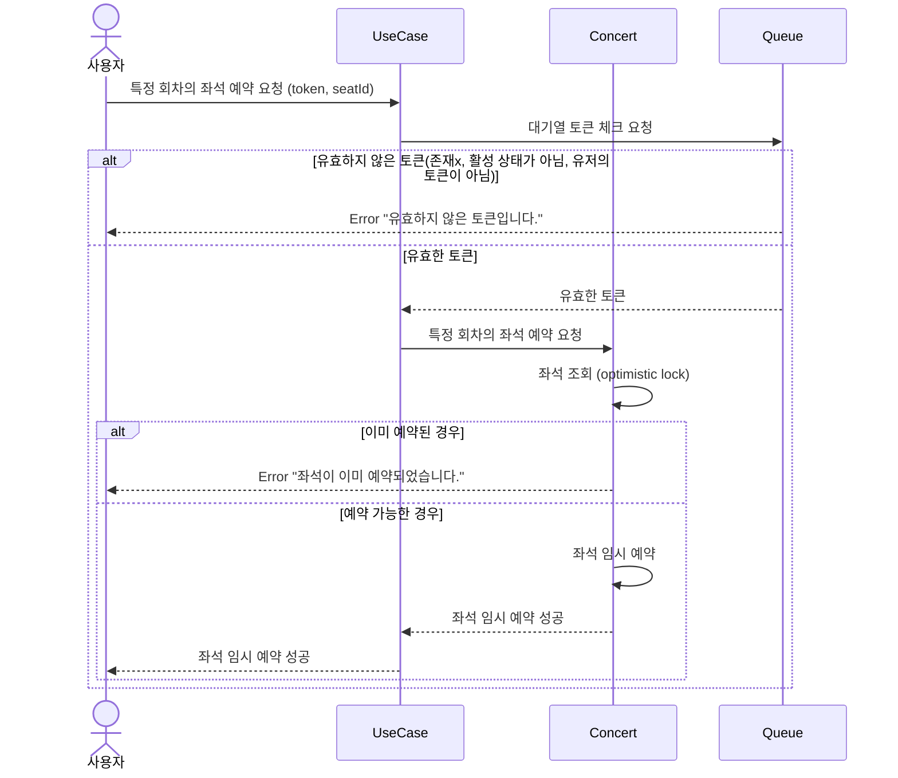

### Description
콘서트 회차의 좌석 예약 요청에 대한 시퀀스 다이어그램입니다.
- 사용자가 대기열 토큰을 포함해 특정 회차의 좌석을 예약 요청하면, 시스템은 해당 토큰이 유효한지 확인합니다.
- 토큰이 유효하지 않은 경우 에러 메시지를 반환합니다.
- 토큰이 활성 상태가 아닌 경우 에러 메시지를 반환합니다.
- 좌석이 이미 예약된 경우 에러 메시지를 반환합니다.
- 좌석이 예약 가능한 경우, 좌석을 임시 예약하고 사용자에게 성공 메시지를 반환합니다.
  - 좌석 임시 예약은 다른 사용자가 예약할 수 없도록 잠금 처리됩니다.

### 6. 결제

---

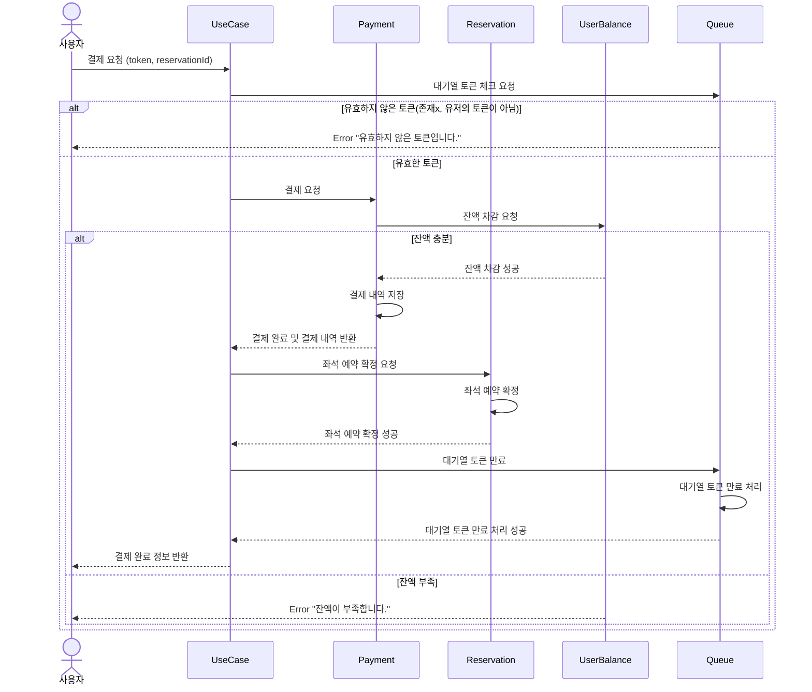

### Description
결제 요청에 대한 시퀀스 다이어그램입니다.
- 사용자가 대기열 토큰을 포함해 예약한 좌석을 결제 요청하면, 시스템은 해당 토큰이 유효한지 확인합니다.
- 토큰이 유효하지 않은 경우 에러 메시지를 반환합니다.
- 결제 요청을 받은 시스템은 사용자의 잔액을 차감합니다.
- 잔액이 충분하지 않은 경우 에러 메시지를 반환합니다.
- 잔액이 충분한 경우 결제 내역을 저장하고, 좌석 예약을 확정합니다.
- 결제 완료 후, 대기열 토큰을 만료 처리합니다.
- 결제 완료 정보를 사용자에게 반환합니다.

 

### 7. 잔액 충전

---
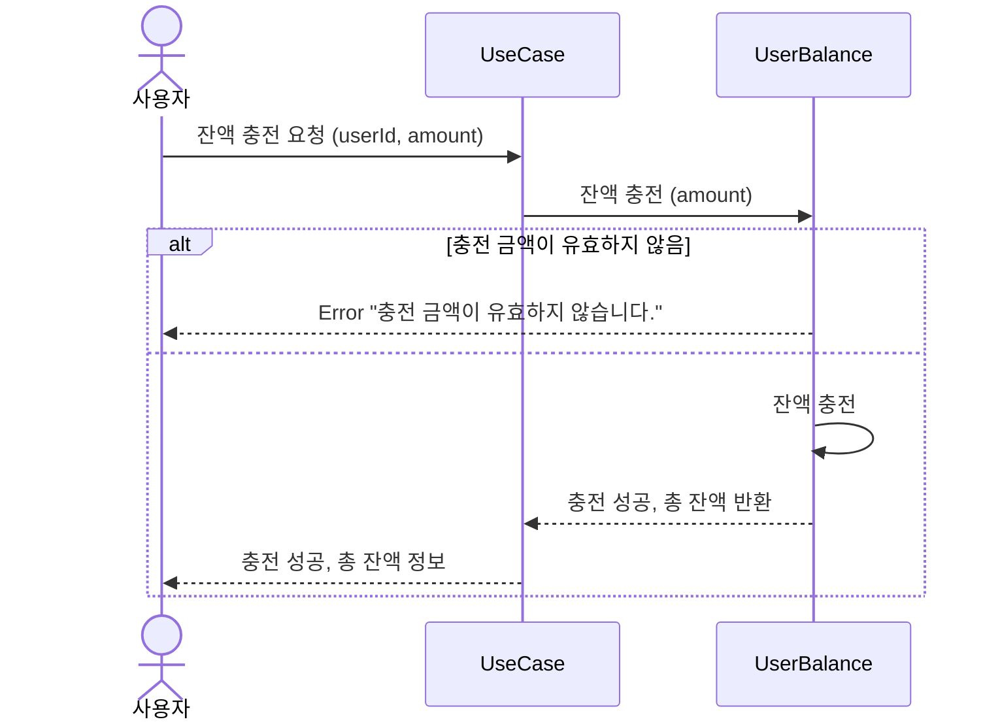

### Description
잔액 충전 요청에 대한 시퀀스 다이어그램입니다.
- 사용자가 잔액 충전 요청을 하면, 시스템은 충전 금액이 유효한지 확인합니다.
- 충전 금액이 유효하지 않은 경우 에러 메시지를 반환합니다.
- 충전 금액이 유효한 경우, 사용자의 잔액을 충전하고, 총 잔액 정보를 반환합니다.

 

### 8. 잔액 조회

---
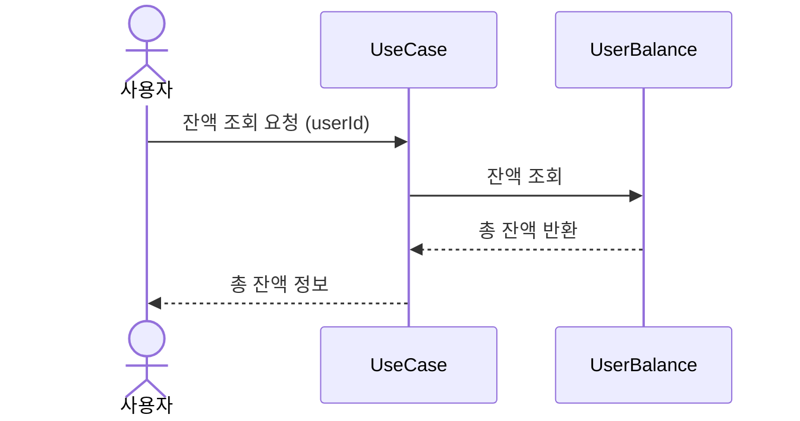

### Description
잔액 조회 요청에 대한 시퀀스 다이어그램입니다.
- 사용자가 잔액 조회 요청을 하면, 시스템은 사용자의 총 잔액 정보를 반환합니다.
- 총 잔액 정보를 사용자에게 반환합니다.

 

### 9. 대기열 활성/만료 스케줄링

---

`대기열 토큰 활성`
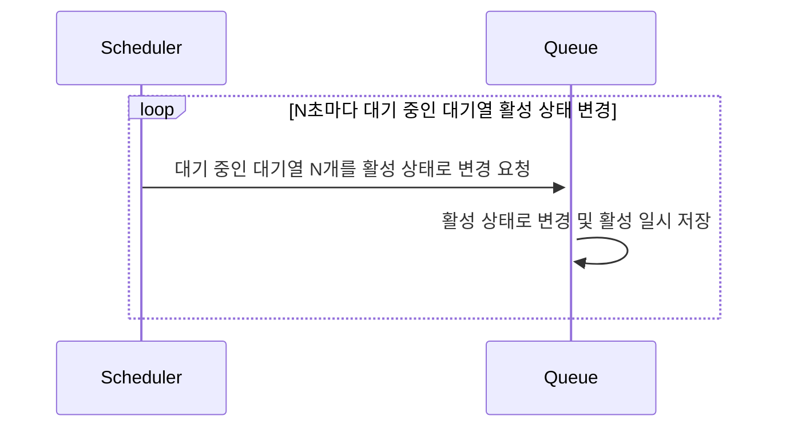

`대기열 활성 토큰 만료`
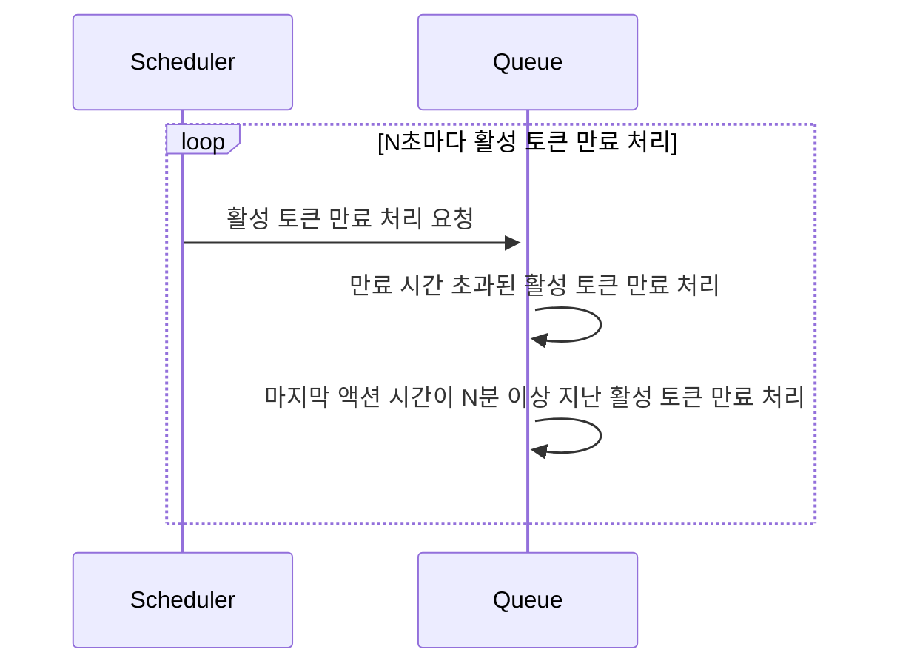

### Description
대기열 토큰 활성/만료 스케줄링에 대한 시퀀스 다이어그램입니다.
- `대기열 토큰 활성`
  - 일정 시간마다 대기 중인 대기열 N 개를 활성 상태로 변경합니다.
- `대기열 활성 토큰 만료`
  - 일정 시간마다 활성 토큰을 만료 처리합니다.
  1. 만료시킬 기준은 활성 일시를 기준으로 합니다.
     - 활성 일시가 N분 이상 지난 토큰은 만료 처리합니다.
  2. 마지막 액션 시간이 N분 이상 지난 활성 토큰은 만료 처리합니다.

 

### 10. 임시 예약 좌석 만료 스케줄링

---
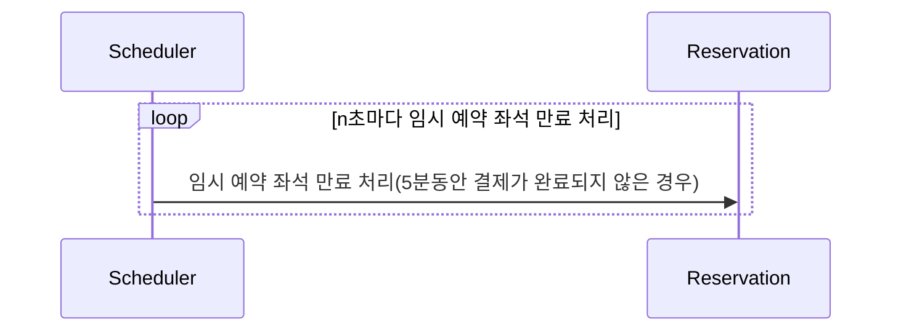

### Description
임시 예약 좌석 만료 스케줄링에 대한 시퀀스 다이어그램입니다.
- 일정 시간마다 임시 예약된 좌석을 만료 처리합니다.
- 만료 조건은 5분동안 결제가 완료되지 않은 경우입니다.
  - 결제 일시 기준으로 5분이 지난 임시 예약 좌석은 만료 처리합니다.